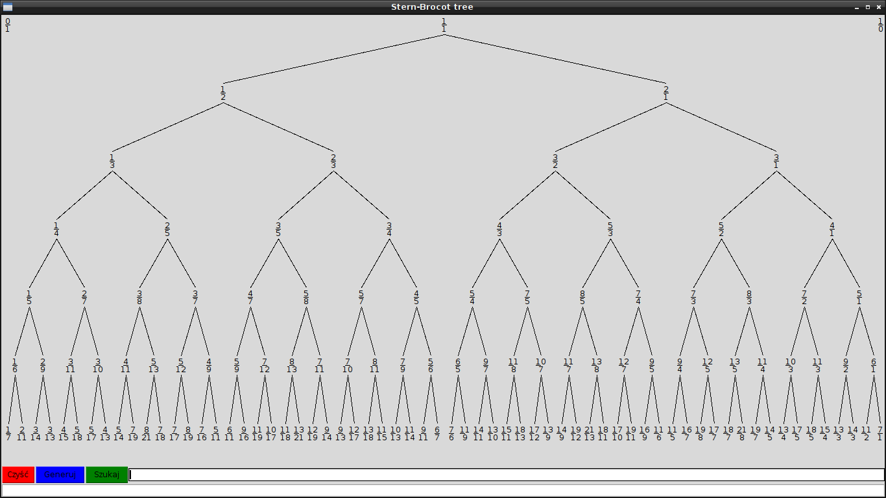
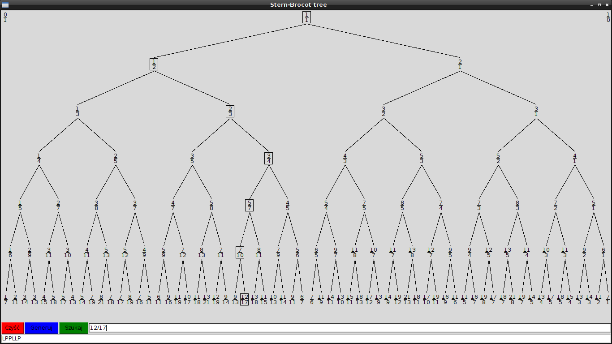
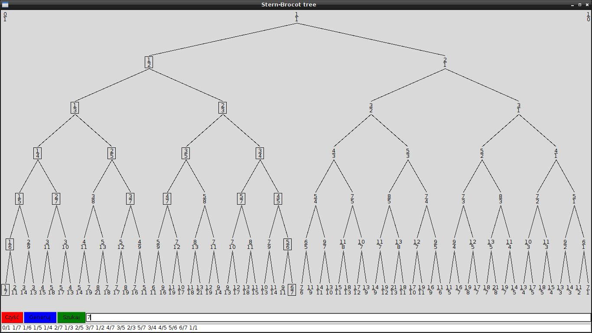

# Stern-Brocot_Tree
Interactive visualization of the Stern-Brocot tree

Searching for a given fraction

Generating all the fractions between 0 and 1 with a denominator not greater than a given integer in an increasing order

